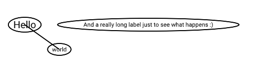

# Graphmage

A graph drawing library for Rust.

This project is very much in prototyping phase. Goal is to make something akin
to Graphviz but more modular and easier to integrate into other projects.

I'd also like it to support generation of UML diagrams where connections
between nodes are attached to appropriate places without having to do any
wizardry.

## Backends

- [x] OpenGL
- [ ] Vulkan
- [ ] WebGPU

This will be a table with supported feature once the project is mature enough.

## Alternatives

- [Graphviz](https://www.graphviz.org/) - a graph visualization software, written in the C programming language.
  - Tricky to integrate into other software
  - Rendering nodes with positioned I/O pins is impossible to do in layout
    agnostic manner.
  - Doesn't handle graph contents during layouting phase.
- [Drawio](https://github.com/jgraph/drawio) - JavaScript, client-side editor for general diagramming and whiteboarding
  - Can't be integrated into native software without a lot of effort and a JS
    engine.
  - Doesn't handle automatic layouting
- Commercial solutions (e.g. Visio, Lucidchart, ...)
  - Can't be integrated into other software
  - Lack of support for intermediate, non-binary, non-proprietary formats

## License

All crates are licensed under terenary [MIT](./LICENSE_MIT)/[Apache 2.0](./LICENSE_APACHE)/[Zlib](./LICENSE_ZLIB) license.
License files are available in the root of the repository.
